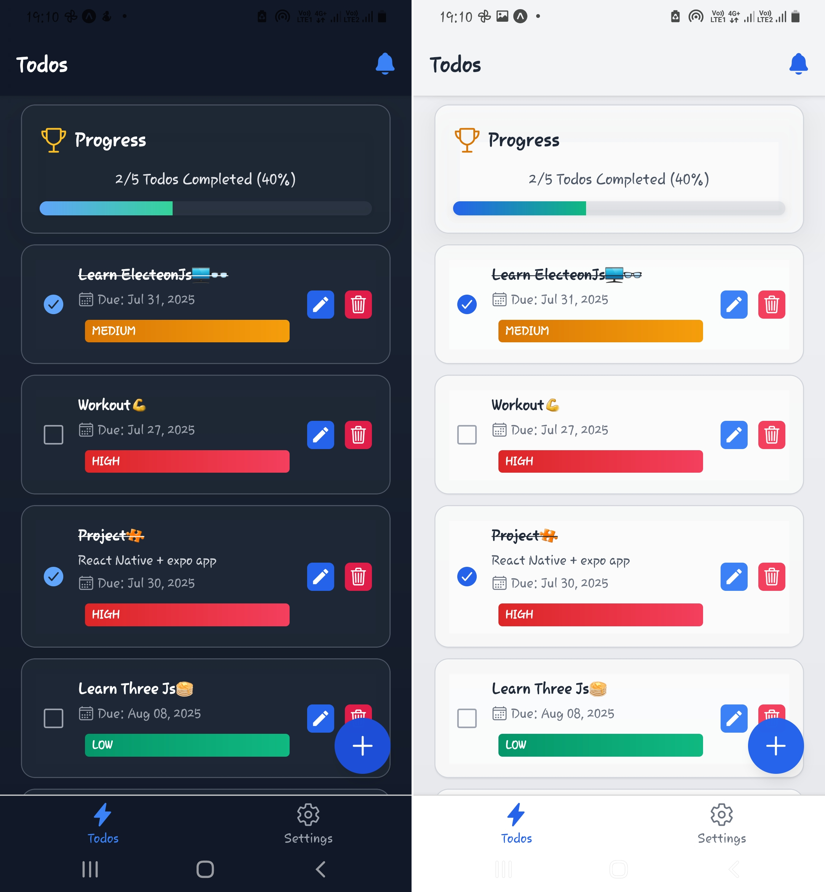
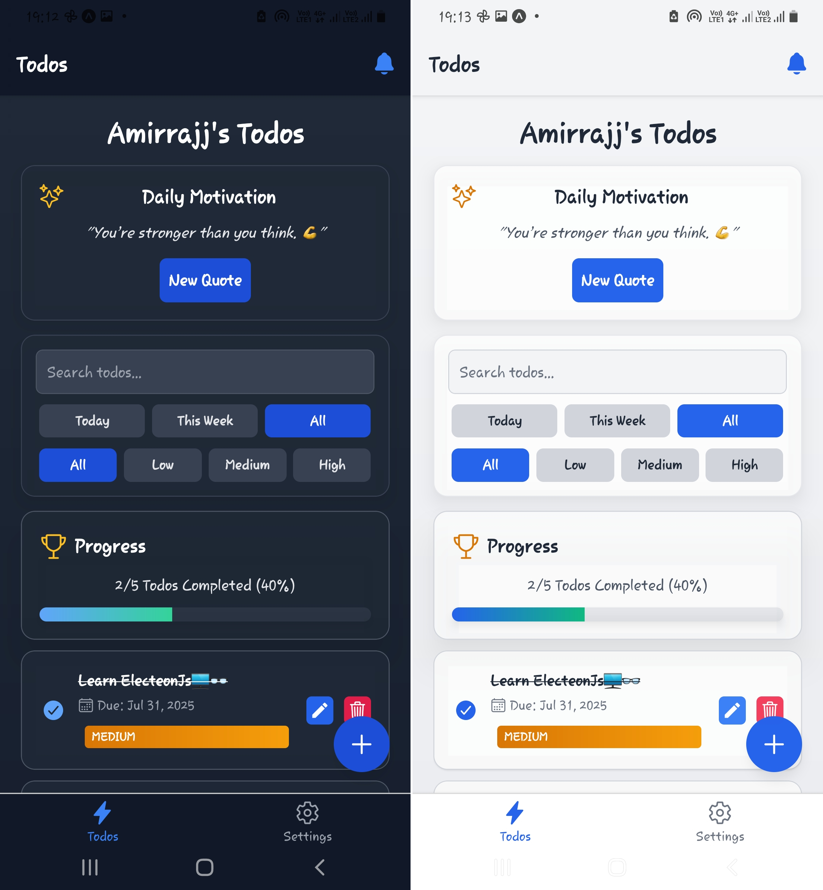
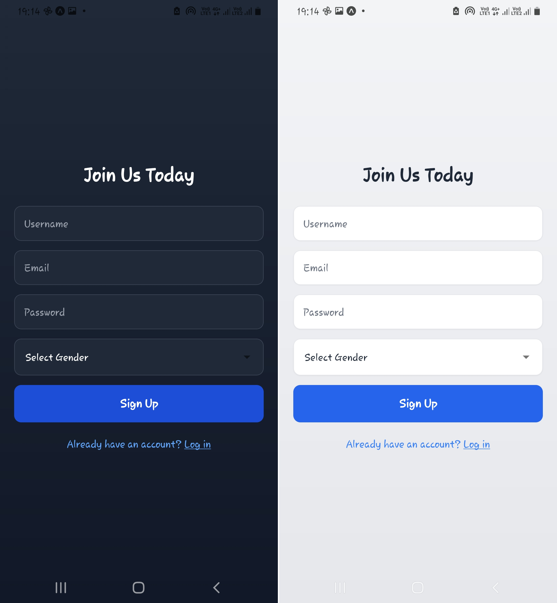
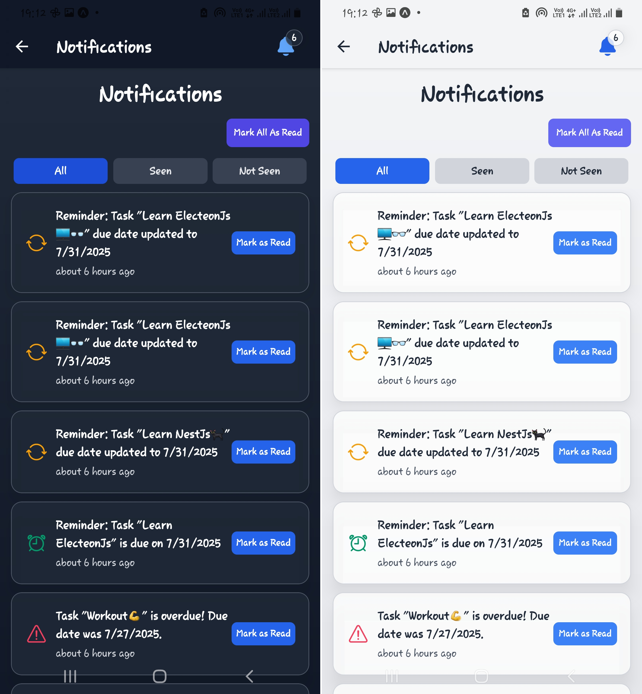
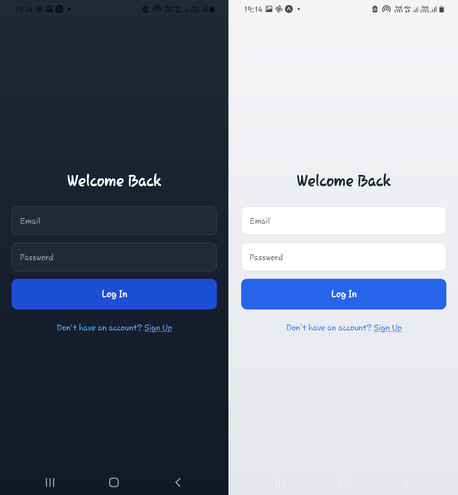
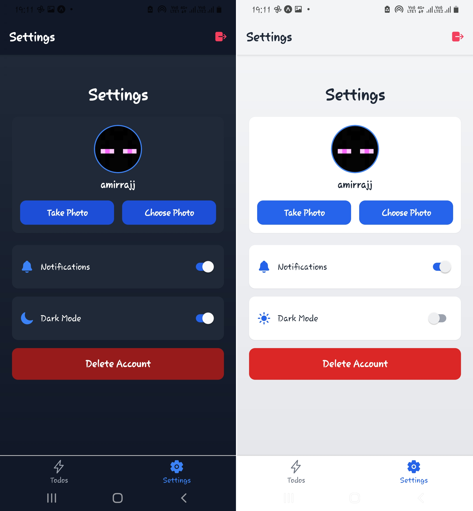

# 🎯 TodoApp - Modern Task & Notification Manager

TodoApp is a full-stack mobile app for task and notification management, built with React Native, Expo, and TypeScript. Featuring glassmorphism UI, animated checkboxes, gradient priority tags, and a dynamic progress bar, it’s your ultimate productivity companion with dark/light theme support.

## 📸 Screenshots

| Home | Signup |
|------|--------|
|  |  |

| Notifications | Login |
|---------------|-------|
|  |  |

| Todos | Settings |
|-------|----------|
|  |  |

## 🚀 Features

- **Task Management**
  - Create/Edit/Update/Delete todos with animated checkboxes
  - Priority system (low, medium, high) with gradient tags
  - Due dates with calendar integration
- **Notifications System**
  - Filter notifications (all, seen, not seen)
  - Mark all as read or delete all
  - Real-time updates with smooth animations
- **User Interface**
  - Glassmorphism design with dark/light themes
  - Animated UI elements (fade-ins, bounces, slides)
  - Dynamic progress bar for task completion
- **Authentication**
  - JWT-based login/signup
  - Secure user sessions
- **Performance**
  - Efficient data fetching with Tanstack Query
  - Lightweight state management with Zustand
- **Themes**
  - Dark and light modes 🔥🔥🔥

## 🛠️ Technologies

**Core Stack:**

- **Frontend**: React Native, Expo, TypeScript
- **Styling**: Tailwind CSS (`nativewind`)
- **State Management**: Tanstack Query, Zustand
- **Backend**: Express, MongoDB
- **Animations**: `react-native-animatable`, `expo-linear-gradient`
- **Icons**: `@expo/vector-icons`

# Hope You Like It My Friend 😉🩷
